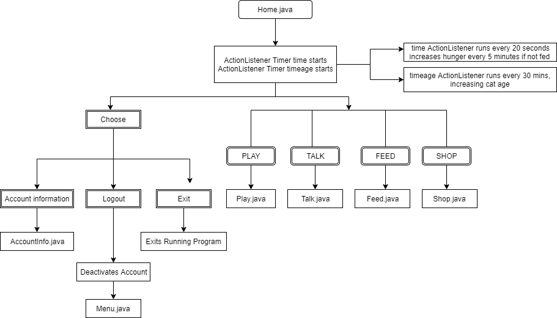
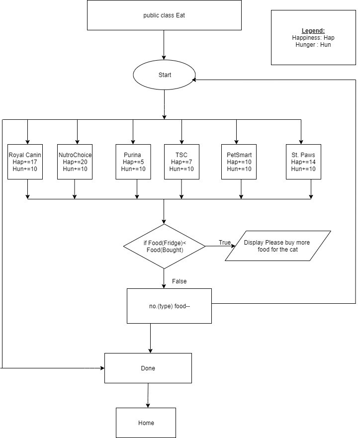

​                                                        **FUNDAMENTALS OF PROGRAMMING**

​                                                                                **WIX(1002)**

​                                                      **ASSIGNMENT TECHNICAL REPORT**

| KAMAL KUMAR KHATRI        | WIC190705 |
|---------------------------|-----------|
| JASSPER LAWRENCE          | WIC190015 |
| MEHDI PIROUZIAN           | WIC190707 |
| KOGHULAN S/O RAJAMANICKAM | WIC190018 |
| GORI SAMEER               | WIC190704 |

PROJECT TITLE : My Cat

LECTURER NAME : PROFESOR MADYA DR. NOR BADRUL ANUAR BIN JUMA'AT

**ABSTRACT**

Our team [NOVAGANG] was assigned to design a user interface that simulates a
virtual pet cat application . It is a graphical user interface in which the user
is able to interact with a randomly generated cat . The user needs to take care
of few things to ensure the cat is alive, happy and excited such as Playing with
the cat , Feeding the cat, Buying food for the cat and talking to the cat. For
the Graphical User Interface (GUI), our team opted for the Java Swing API. The
user is required to interact with the cat as if it was a real cat as it follows
the real time and has its own time to live. Since our game is offline, our team
decided to store the user data and cat data into a text file and reading from it
to save the game before the player exits the game. The extra features we have
added are having multiple types of food in the shop that gives or yields varying
amounts of happiness , the ability of the virtual pet to ‘meow’ when talking to
it alongside learning new types of sound when the cat levels up. The playing
application is in a GUI.

**Requirements**

1)The project should always run from the menu.java class

2)Presence of active.txt file is necessary with "3" as String stored into it initially.

3)All the media files should be stored in project location folder

**Introduction**

To begin the assignment we members of the team had to brainstorm on a concrete and
easy to understand game levelling logic plus also know how to create a graphical
user interface to implement the game logic to interact with the cats in the game
 interface . We needed a sample program to have a general idea of what the
program should look like in the end . Therefore , we had to do a lot of research
such as going through tutorials online on youtube to create a Graphical User
Interface using Java Swing , creating a game for the virtual cat to play .

**References and Media Used**

**Cat Meows:**

1.  <https://www.zapsplat.com/sound-effect-category/cats/>

**Cat Icons :**

1.Black Cat :

<https://www.pinterest.com/pin/393783561158839986/?lp=true>

2. Grey Cat:

<https://www.pinterest.com/pin/create/button/?url=http%3A%2F%2Fbestanimations.com%2FAnimals%2FMammals%2FCats%2FCats4.html%23.XfDP_H3WL7o.pinterest&media=http%3A%2F%2Fbestanimations.com%2FAnimals%2FMammals%2FCats%2Fcats%2Fcute-kitty-animated-gif-34.gif&description=animated+gif+images>

3.Fawn/Ginger Cat :

<https://wifflegif.com/gifs/571830-sleeping-kitty-cat-pixel-gif>

4.White/Snow Cat :

http://bestanimations.com/Animals/Mammals/Cats/cats/cute-kitty-animated-gif-59.gif#.XfIISeWuMkM.link

***<u>Flow charts**</u>*

**Menu.java**

**Signup.java**

**acc_creation.java**

**Login.java**

**Home.java**

**AccountInfo.java**

**keylist.java**

**Catsounds.java**

**Eat.java**

**Shop.java**

**Customize.java**

**Cat.java**

**Levelling and experience gained strategy:**

**timecal.java**

**Program Output**

**Signup**

**Test**

**Account Creation**

**Login**

**Home**

**Shop**

**Eat**

**catsounds**

**Play**

**Account,Logout,Exit**

